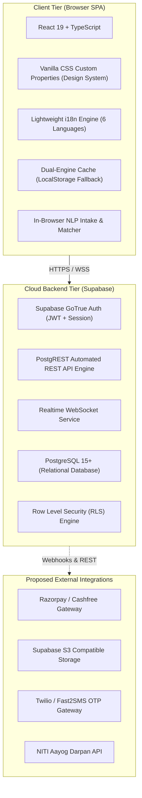
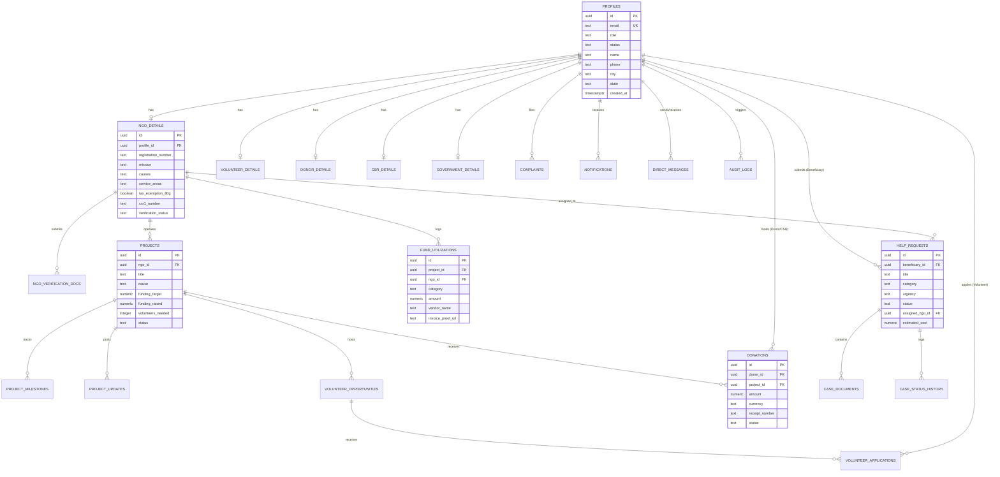
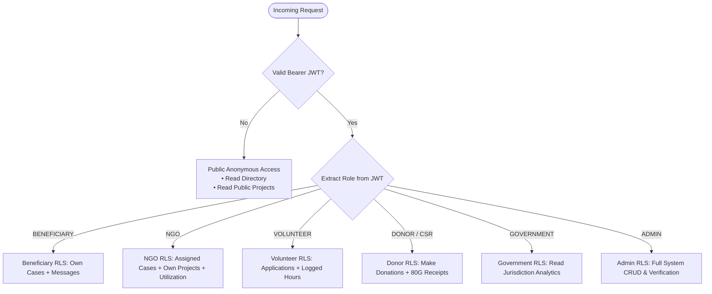
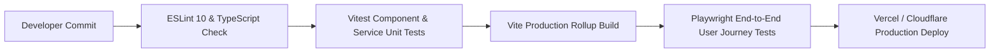

# Technical Requirements Document (TRD)

## Project: NGO Digital Connect
**Document Version:** 1.0.0  
**Status:** Authoritative Technical Specification  
**Classification:** Engineering Architecture & System Implementation  
**Runtime Environment:** Client-Side Single Page Application (React 19 + TypeScript + Vite) with PostgreSQL / Supabase Backend-as-a-Service (BaaS)

---

## 1. Technology Stack & Architectural Justifications

The NGO Digital Connect technical stack is engineered around principles of **low-bandwidth resilience**, **rapid client execution**, **strong relational integrity**, and **zero-infrastructure overhead**:



### 1.1 Detailed Stack Evaluation & Trade-offs

| Component | Technology | Rationale & Justification | Evaluated Alternatives & Why Rejected |
| :--- | :--- | :--- | :--- |
| **Frontend Framework** | **React 19** (`react`, `react-dom` 19.2.8) | Modern concurrent rendering, fast transition hooks, lightweight virtual DOM, wide developer familiarity, seamless component tree lifecycle management. | *Next.js / SSR*: Rejected due to complex cold starts, mandatory Node.js server infrastructure, and higher data consumption for low-connectivity rural users. |
| **Language & Typings** | **TypeScript 6.0** (`tsconfig.app.json`) | Enforces compile-time type safety across 20+ complex relational models, eliminates `undefined` runtime exceptions during volunteer/donor data processing. | *Vanilla JavaScript*: Rejected due to lack of type guarantees across complex multi-role state mutations. |
| **Build & Tooling** | **Vite 8.3** | Lightning-fast Hot Module Replacement (HMR), optimized Rollup production bundling, native ES module compilation producing < 180 KB gzipped bundles. | *Webpack / Create-React-App*: Deprecated, sluggish build cycles, excessive polyfills, bloated bundle size. |
| **Styling & Theming** | **Vanilla CSS Tokens** (`index.css`) | Zero runtime CSS-in-JS overhead, pure CSS variables (`--primary`, `--bg-main`, `--border`) for instant light/dark mode switching, zero dependency maintenance. | *Tailwind CSS*: Requires extensive utility purge pipeline and external build plugins; *MUI/Chakra*: Heavy bundle weight (> 300 KB) which degrades 2G/3G mobile performance. |
| **Database & Engine** | **PostgreSQL 15+** | ACID-compliant transactional integrity, native UUIDs, arrays (`text[]`), JSONB structures, robust trigger automation (`plpgsql`), and Row Level Security. | *MongoDB / NoSQL*: Rejected due to lack of strict relational constraints across donor payments, project milestones, and KYC documents. |
| **Backend & API** | **Supabase BaaS** (`@supabase/supabase-js` 2.117.2) | Provides instant RESTful endpoints via PostgREST, integrated GoTrue identity authentication, and WebSocket-driven real-time database changes. | *Custom Express/NestJS Server*: Requires ongoing infrastructure provisioning, container orchestration, patching, and higher cloud operating costs. |
| **Offline Fallback** | **Dual-Engine Persistence** (`StorageService.ts`) | Allows complete application testing, offline prototyping, and rural demo execution without active internet or database connections via `localStorage`. | *IndexedDB*: More complex async initialization; simple JSON localStorage is sufficient for demo/offline caching (< 5MB limit). |

---

## 2. Module & Feature Breakdown

### 2.1 Authentication & Profile Lifecycle (`AuthContext.tsx`)
* **State Management:** Manages `currentUser`, `allUsers`, `isLoadingAuth`, `authError`, `realtimeStatus`, and `isSupabaseConnected`.
* **Registration Flow:**
  1. Calls `supabase.auth.signUp()` with user metadata (name, role, phone, location, organization).
  2. PostgreSQL trigger `handle_new_user()` atomically inserts a corresponding row into `public.profiles` and provisions a child record in the appropriate role table (`ngo_details`, `volunteer_details`, `donor_details`, `csr_details`, `government_details`).
  3. Client updates React state and mirrors profile in `localStorage`.
* **Session Restoration:** Restores active JWT session via `supabase.auth.getSession()` and subscribes to `onAuthStateChange`.
* **Role Testing Switcher:** Provides 1-click persona switching (`loginAsRole`) for developer demonstration (*Marked for removal in production*).

### 2.2 Global Data & Realtime Engine (`DataContext.tsx`)
* **Reactive Collections:** Centralizes live arrays for `cases`, `projects`, `opportunities`, `applications`, `donations`, `utilizations`, `auditLogs`, `complaints`, `notifications`, and `messages`.
* **Realtime Synchronization:** Establishes Supabase WebSocket channels across key tables (`help_requests`, `projects`, `donations`, `volunteer_opportunities`) to broadcast real-time state changes to all connected clients.
* **Notification Dispatcher:** Dispatches in-app banners (`activeToast`) with auto-dismiss timers upon significant actions (e.g., donation completed, case assigned).

### 2.3 Intelligent Natural Language Processing & Matching (`aiService.ts`)
* **Intake Classifier (`classifyRequestDescription`):** Tokenizes citizen text input to detect clinical, scholastic, nutritional, disaster, and environmental terms. Automatically assigns `urgency` (`LOW`, `MEDIUM`, `HIGH`, `CRITICAL`), `category`, and `suggestedSupportType`.
* **NGO Case Matcher (`matchNgosForCase`):** Calculates weighted match scores (0–99%) for verified NGOs operating in the same district and cause category.
* **Volunteer Skill Matcher (`matchOpportunitiesForVolunteer`):** Analyzes volunteer declared skills and cause preferences against active opportunity requirements.
* **NGO Operations Copilot (`queryNgoAssistant`):** Evaluates prompt intent to output contextual summaries of unfulfilled volunteer slots, underfunded initiatives, and pending milestones.

### 2.4 Vernacular Localization Engine (`LanguageContext.tsx`)
* **Translation Coverage:** Full key-value dictionary mapping for 6 Indian languages (`en`, `hi`, `bn`, `mr`, `ta`, `te`).
* **Fallback Strategy:** If a localized key is missing in a regional translation file, the engine automatically falls back to standard English (`en.ts`).

---

## 3. Database Schema & Entity-Relationship (ER) Design

The database is built on **PostgreSQL 15** with 21 relational tables partitioned into 6 functional domains:



### 3.1 Data Dictionary (21 Normalized Tables)

#### Domain A: User Identity & Role Profiles
1. **`profiles`**: Master user identity linked to Supabase Auth (`auth.users.id`).
   * `id` (UUID, PK), `email` (TEXT, UNIQUE), `role` (TEXT: `BENEFICIARY`, `NGO`, `VOLUNTEER`, `DONOR`, `CSR`, `GOVERNMENT`, `ADMIN`), `status` (`ACTIVE`, `PENDING_VERIFICATION`, `SUSPENDED`), `name`, `phone`, `city`, `state`, `country`, `bio`, `avatar`, `organization_name`, `designation`, `created_at`, `updated_at`.
2. **`ngo_details`**: Extended non-profit regulatory & operational metadata.
   * `id` (UUID, PK), `profile_id` (UUID, FK -> profiles.id, UNIQUE), `ngo_id` (TEXT, UNIQUE), `registration_number` (TEXT), `founded_year` (INT), `mission` (TEXT), `causes` (TEXT[]), `service_areas` (TEXT[]), `tax_exemption_80g` (BOOLEAN), `csr1_number` (TEXT), `verification_status` (`UNVERIFIED`, `PENDING`, `VERIFIED`, `REJECTED`, `SUSPENDED`), `total_beneficiaries_served` (INT), `active_project_count` (INT), `created_at`, `updated_at`.
3. **`ngo_verification_documents`**: KYC files uploaded by NGOs.
   * `id` (UUID, PK), `ngo_detail_id` (UUID, FK -> ngo_details.id), `type` (TEXT: `TRUST_DEED`, `PAN_CARD`, `80G_CERT`, `DARPAN_REG`), `url` (TEXT), `submitted_at` (TIMESTAMPTZ).
4. **`volunteer_details`**: Volunteer capacity & skills.
   * `id` (UUID, PK), `profile_id` (UUID, FK -> profiles.id, UNIQUE), `skills` (TEXT[]), `causes` (TEXT[]), `availability` (`WEEKDAYS`, `WEEKENDS`, `FLEXIBLE`, `FULL_TIME`), `hours_logged` (NUMERIC), `experience_years` (INT), `created_at`, `updated_at`.
5. **`donor_details`**: Individual donor preferences.
   * `id` (UUID, PK), `profile_id` (UUID, FK -> profiles.id, UNIQUE), `preferred_causes` (TEXT[]), `tax_pan` (TEXT), `total_donated` (NUMERIC), `is_anonymous_preferred` (BOOLEAN), `created_at`, `updated_at`.
6. **`csr_details`**: Corporate giving & legal identifiers.
   * `id` (UUID, PK), `profile_id` (UUID, FK -> profiles.id, UNIQUE), `company_name` (TEXT), `cin_number` (TEXT), `annual_budget` (NUMERIC), `focus_states` (TEXT[]), `preferred_causes` (TEXT[]), `grants_committed` (NUMERIC), `created_at`, `updated_at`.
7. **`government_details`**: Regulatory officers and nodal monitoring units.
   * `id` (UUID, PK), `profile_id` (UUID, FK -> profiles.id, UNIQUE), `department` (TEXT), `official_jurisdiction` (TEXT), `designation` (TEXT), `authorized_id_number` (TEXT), `created_at`, `updated_at`.

#### Domain B: Social Projects & Milestone Crowdfunding
8. **`projects`**: Initiatives operated by NGOs.
   * `id` (UUID, PK), `ngo_id` (UUID, FK -> profiles.id), `ngo_name` (TEXT), `title` (TEXT), `description` (TEXT), `cause` (TEXT), `city` (TEXT), `state` (TEXT), `target_beneficiaries` (INT), `reached_beneficiaries` (INT), `start_date` (DATE), `end_date` (DATE), `funding_target` (NUMERIC), `funding_raised` (NUMERIC), `volunteers_needed` (INT), `volunteers_enrolled` (INT), `status` (`DRAFT`, `UPCOMING`, `ACTIVE`, `PAUSED`, `COMPLETED`, `CANCELLED`), `image_url` (TEXT), `allow_overfunding` (BOOLEAN), `created_at`, `updated_at`.
9. **`project_milestones`**: Measurable deliverables per project.
   * `id` (UUID, PK), `project_id` (UUID, FK -> projects.id), `title` (TEXT), `target_date` (DATE), `is_completed` (BOOLEAN), `completed_date` (DATE), `evidence_url` (TEXT), `notes` (TEXT).
10. **`project_updates`**: Field progress dispatches for public transparency.
    * `id` (UUID, PK), `project_id` (UUID, FK -> projects.id), `title` (TEXT), `content` (TEXT), `image_url` (TEXT), `posted_date` (TIMESTAMPTZ).

#### Domain C: Citizen Distress Cases
11. **`help_requests`**: Beneficiary assistance tickets.
    * `id` (UUID, PK), `beneficiary_id` (UUID, FK -> profiles.id), `beneficiary_name` (TEXT), `contact_phone` (TEXT), `title` (TEXT), `category` (TEXT), `urgency` (`LOW`, `MEDIUM`, `HIGH`, `CRITICAL`), `description` (TEXT), `city` (TEXT), `state` (TEXT), `address` (TEXT), `postal_code` (TEXT), `required_support_type` (`FINANCIAL`, `MEDICAL`, `FOOD_RATION`, `EDUCATION`, `SHELTER`, `EQUIPMENT`, `VOLUNTEER_HELP`), `estimated_cost` (NUMERIC), `status` (`SUBMITTED`, `UNDER_REVIEW`, `VERIFIED`, `MATCHED`, `ACCEPTED`, `IN_PROGRESS`, `RESOLVED`, `CLOSED`, `REJECTED`, `ON_HOLD`, `CANCELLED`), `assigned_ngo_id` (UUID, FK -> profiles.id), `assigned_ngo_name` (TEXT), `linked_project_id` (UUID, FK -> projects.id), `resolution_notes` (TEXT), `resolution_evidence_url` (TEXT), `submitted_at`, `updated_at`.
12. **`case_documents`**: Evidence attachments (hospital estimates, ration cards).
    * `id` (UUID, PK), `case_id` (UUID, FK -> help_requests.id), `name` (TEXT), `url` (TEXT), `type` (TEXT), `uploaded_at` (TIMESTAMPTZ).
13. **`case_status_history`**: Immutable lifecycle audit log of case updates.
    * `id` (UUID, PK), `case_id` (UUID, FK -> help_requests.id), `status` (TEXT), `updated_by` (TEXT), `note` (TEXT), `updated_at` (TIMESTAMPTZ).

#### Domain D: Volunteering Engine
14. **`volunteer_opportunities`**: Openings posted by NGOs.
    * `id` (UUID, PK), `project_id` (UUID, FK -> projects.id), `ngo_id` (UUID, FK -> profiles.id), `title` (TEXT), `cause` (TEXT), `description` (TEXT), `city` (TEXT), `state` (TEXT), `mode` (`ON_FIELD`, `REMOTE`, `HYBRID`), `date` (DATE), `duration` (TEXT), `skills_required` (TEXT[]), `slots_total` (INT), `slots_filled` (INT), `status` (`OPEN`, `FULL`, `COMPLETED`, `CANCELLED`), `requirements` (TEXT[]), `created_at`.
15. **`volunteer_applications`**: Applications submitted by volunteers.
    * `id` (UUID, PK), `opportunity_id` (UUID, FK -> volunteer_opportunities.id), `volunteer_id` (UUID, FK -> profiles.id), `volunteer_name` (TEXT), `ngo_id` (UUID, FK -> profiles.id), `status` (`PENDING`, `ACCEPTED`, `REJECTED`, `COMPLETED`), `hours_logged` (NUMERIC), `feedback` (TEXT), `applied_at` (TIMESTAMPTZ).

#### Domain E: Financial Transparency & Utilization
16. **`donations`**: Verified funds contributed to projects.
    * `id` (UUID, PK), `donor_id` (UUID, FK -> profiles.id), `donor_name` (TEXT), `project_id` (UUID, FK -> projects.id), `ngo_id` (UUID, FK -> profiles.id), `amount` (NUMERIC), `currency` (TEXT DEFAULT 'INR'), `receipt_number` (TEXT, UNIQUE), `payment_method` (TEXT), `status` (`SUCCESSFUL`, `PROCESSING`, `REFUNDED`), `is_anonymous` (BOOLEAN), `donor_message` (TEXT), `donated_at` (TIMESTAMPTZ).
17. **`fund_utilizations`**: Itemized expenditures logged by NGOs against projects.
    * `id` (UUID, PK), `project_id` (UUID, FK -> projects.id), `ngo_id` (UUID, FK -> profiles.id), `category` (`DIRECT_RELIEF`, `MEDICAL_SUPPLIES`, `FOOD_PROVISIONS`, `EDUCATION_KITS`, `LOGISTICS_TRANSPORT`, `FIELD_EQUIPMENT`, `SHELTER_MATERIALS`), `amount` (NUMERIC), `description` (TEXT), `spent_date` (DATE), `vendor_name` (TEXT), `invoice_proof_url` (TEXT), `recorded_by` (TEXT), `created_at` (TIMESTAMPTZ).

#### Domain F: Communication, Oversight & Auditing
18. **`audit_logs`**: System activity trail.
    * `id` (UUID, PK), `actor_id` (UUID), `actor_name` (TEXT), `actor_role` (TEXT), `action` (TEXT), `target_entity` (TEXT: `CASE`, `PROJECT`, `DONATION`, `OPPORTUNITY`, `NGO`, `USER`), `target_id` (TEXT), `details` (TEXT), `timestamp` (TIMESTAMPTZ).
19. **`complaints`**: Grievances filed by community members.
    * `id` (UUID, PK), `reporter_id` (UUID, FK -> profiles.id), `reporter_name` (TEXT), `target_type` (TEXT: `PROJECT`, `NGO`, `USER`, `CASE`), `target_id` (TEXT), `target_title` (TEXT), `reason` (TEXT), `description` (TEXT), `status` (`OPEN`, `INVESTIGATING`, `RESOLVED`, `DISMISSED`), `resolution_note` (TEXT), `reported_at` (TIMESTAMPTZ).
20. **`notifications`**: Targeted user alerts.
    * `id` (UUID, PK), `user_id` (UUID, FK -> profiles.id), `title` (TEXT), `message` (TEXT), `type` (`INFO`, `SUCCESS`, `WARNING`, `ALERT`), `action_url` (TEXT), `is_read` (BOOLEAN DEFAULT false), `created_at` (TIMESTAMPTZ).
21. **`direct_messages`**: Chat communications between beneficiaries and assigned NGOs.
    * `id` (UUID, PK), `case_id` (UUID, FK -> help_requests.id), `sender_id` (UUID, FK -> profiles.id), `sender_name` (TEXT), `sender_role` (TEXT), `receiver_id` (UUID, FK -> profiles.id), `receiver_name` (TEXT), `content` (TEXT), `timestamp` (TIMESTAMPTZ).

---

## 4. API Specification

The primary API interface operates via **Supabase PostgREST** with automated JSON serialization and OpenAPI 3.0 conformance:

### 4.1 Core PostgREST Endpoints

#### `POST /auth/v1/signup`
* **Description:** Creates an authenticated user in `auth.users` and invokes `handle_new_user()` trigger.
* **Auth Required:** None (Public).
* **Request Body:**
  ```json
  {
    "email": "director@preronamission.org",
    "password": "SecurePassword123!",
    "data": {
      "name": "Dr. Ananya Sen",
      "role": "NGO",
      "phone": "+91 98300 12345",
      "city": "Kolkata",
      "state": "West Bengal",
      "organizationName": "Prerona Mission",
      "registrationNumber": "WB-ACT-1961-4492"
    }
  }
  ```
* **Response (200 OK):**
  ```json
  {
    "user": {
      "id": "e4b6d8a0-2f1c-4b5a-9e3d-8c7a6b5c4d3e",
      "email": "director@preronamission.org",
      "role": "authenticated",
      "user_metadata": { "role": "NGO", "name": "Dr. Ananya Sen" }
    },
    "session": { "access_token": "eyJhbG...", "expires_in": 3600 }
  }
  ```
* **Error Codes:** `400 Bad Request` (Weak password, invalid email), `422 Unprocessable Entity` (Email already registered).

#### `GET /rest/v1/help_requests`
* **Description:** Retrieves paginated help requests based on role RLS filtering.
* **Auth Required:** Bearer Token (JWT).
* **Query Parameters:** `select=*`, `category=eq.healthcare`, `urgency=eq.CRITICAL`, `order=submitted_at.desc`, `limit=20`.
* **Response (200 OK):**
  ```json
  [
    {
      "id": "req-9912",
      "title": "Immediate Cardiac Surgery for Child",
      "category": "healthcare",
      "urgency": "CRITICAL",
      "status": "SUBMITTED",
      "city": "Howrah",
      "state": "West Bengal",
      "required_support_type": "MEDICAL",
      "estimated_cost": 150000,
      "submitted_at": "2026-10-02T10:30:00Z"
    }
  ]
  ```
* **Error Codes:** `401 Unauthorized` (Invalid/expired JWT), `403 Forbidden` (Violates RLS).

#### `POST /rest/v1/donations`
* **Description:** Records a verified financial contribution and updates project total.
* **Auth Required:** Bearer Token (Role: `DONOR`, `CSR`, `ADMIN`).
* **Request Body:**
  ```json
  {
    "project_id": "proj-441",
    "amount": 5000,
    "payment_method": "UPI / NetBanking",
    "is_anonymous": false,
    "donor_message": "For the children's recovery."
  }
  ```
* **Response (201 Created):**
  ```json
  {
    "id": "don-8821",
    "receipt_number": "80G-2026-7842",
    "amount": 5000,
    "currency": "INR",
    "status": "SUCCESSFUL",
    "donated_at": "2026-10-02T16:45:00Z"
  }
  ```
* **Error Codes:** `400 Bad Request` (Invalid amount <= 0), `404 Not Found` (Project ID does not exist).

#### `POST /rest/v1/fund_utilizations`
* **Description:** Logs itemized expense vouchers backed by invoices.
* **Auth Required:** Bearer Token (Role: `NGO`, `ADMIN`).
* **Request Body:**
  ```json
  {
    "project_id": "proj-441",
    "category": "MEDICAL_SUPPLIES",
    "amount": 28500,
    "description": "Pediatric surgical stent consumables",
    "spent_date": "2026-10-01",
    "vendor_name": "Apollo Surgical Goods Ltd.",
    "invoice_proof_url": "https://storage.ngoconnect.org/invoices/inv-092.pdf"
  }
  ```
* **Response (201 Created):**
  ```json
  {
    "id": "util-1102",
    "status": "RECORDED",
    "created_at": "2026-10-02T16:50:00Z"
  }
  ```
* **Error Codes:** `403 Forbidden` (User does not own the project), `422 Unprocessable Entity` (Missing invoice proof URL).

---

## 5. Authentication & Authorization Design (RBAC Matrix)



### 5.1 Permissions Matrix

| Platform Action / Resource | Beneficiary | NGO | Volunteer | Donor | CSR | Government | Admin |
| :--- | :---: | :---: | :---: | :---: | :---: | :---: | :---: |
| **Submit Help Request** | **Own** | ✗ | ✗ | ✗ | ✗ | ✗ | ✓ |
| **View Own Case Status & Chat** | **Own** | ✗ | ✗ | ✗ | ✗ | ✗ | ✓ |
| **Review & Accept District Cases** | ✗ | **District** | ✗ | ✗ | ✗ | ✗ | ✓ |
| **Resolve Case with Evidence** | ✗ | **Assigned** | ✗ | ✗ | ✗ | ✗ | ✓ |
| **Create Social Project** | ✗ | ✓ | ✗ | ✗ | ✗ | ✗ | ✓ |
| **Update Project Milestones** | ✗ | **Own** | ✗ | ✗ | ✗ | ✗ | ✓ |
| **Log Fund Utilization & Invoices**| ✗ | **Own** | ✗ | ✗ | ✗ | ✗ | ✓ |
| **Post Volunteer Opportunity** | ✗ | ✓ | ✗ | ✗ | ✗ | ✗ | ✓ |
| **Apply for Opportunity** | ✗ | ✗ | ✓ | ✗ | ✗ | ✗ | ✗ |
| **Approve Volunteer Applications** | ✗ | **Own Opps** | ✗ | ✗ | ✗ | ✗ | ✓ |
| **Make Project Donation** | ✗ | ✗ | ✗ | ✓ | ✓ | ✗ | ✓ |
| **Download Section 80G Receipt** | ✗ | ✗ | ✗ | **Own** | **Own** | ✗ | ✓ |
| **View Macro Jurisdiction Analytics**| ✗ | ✗ | ✗ | ✗ | ✗ | **Jurisdiction**| ✓ |
| **Verify / Accredit NGOs (KYC)** | ✗ | ✗ | ✗ | ✗ | ✗ | ✗ | ✓ |
| **Investigate Grievance Complaints**| ✗ | ✗ | ✗ | ✗ | ✗ | ✗ | ✓ |
| **Inspect System Audit Logs** | ✗ | ✗ | ✗ | ✗ | ✗ | ✗ | ✓ |

---

## 6. Third-Party Integrations

### 6.1 Payment Gateway (Razorpay / Cashfree)
* **Current Implementation:** High-fidelity client-side verification engine generating certified Section 80G receipts (`receiptNumber: 80G-YYYY-XXXX`).
* **Proposed Production Integration:**
  * **Order Creation:** Client requests serverless Edge Function `/api/create-order` with `projectId` and `amount`. Server creates order via Razorpay API (`orders.create`).
  * **Checkout:** Client loads Razorpay Standard Checkout modal.
  * **Webhook Verification:** Serverless webhook `/api/razorpay-webhook` validates `x-razorpay-signature` using HMAC-SHA256, inserts record into `donations`, increments `funding_raised` in `projects`, and dispatches email receipt.

### 6.2 Storage Gateway (Supabase Storage / AWS S3)
* **Current Implementation:** URL strings referencing external or sample assets.
* **Proposed Production Integration:**
  * Dedicated private buckets: `ngo-verification-vault` (Private, Admin only), `invoice-receipts` (Public Read, NGO Write), `case-evidence` (Private, Beneficiary & Assigned NGO).
  * Enforce pre-signed upload URLs (`supabase.storage.from('...').createSignedUploadUrl()`).
  * Server-side MIME validation (blocking executable files, `.exe`, `.js`, `.sh`) and maximum file size cap (5 MB).

### 6.3 Messaging & SMS OTP Gateway (Twilio / Fast2SMS)
* **Current Implementation:** In-app real-time notification engine (`notifications` table + React toasts).
* **Proposed Production Integration:**
  * Passwordless login for low-literacy beneficiaries via SMS 6-digit OTP.
  * Automated WhatsApp alerts to NGO coordinators when a `CRITICAL` urgency medical case is submitted within their operational district.

---

## 7. Performance Targets, Scalability & Logging

### 7.1 Caching & Latency Optimization
* **Database Indexing:** Compound indexes on foreign keys and filter columns:
  * `CREATE INDEX idx_cases_category_urgency ON help_requests(category, urgency);`
  * `CREATE INDEX idx_cases_district ON help_requests(city, state);`
  * `CREATE INDEX idx_projects_status ON projects(status);`
  * `CREATE INDEX idx_donations_project ON donations(project_id);`
* **Client-Side Memoization:** `useMemo` utilized across `DataContext.tsx` for filtered project feeds, active volunteer opportunities, and user donation histories.

### 7.2 Structured Error Handling & Audit Logging
* **Client Toast Interceptors:** All failed network requests caught in `try...catch` blocks and presented as human-readable error banners.
* **Immutable Audit Trail:** All administrative and financial state updates recorded to `audit_logs` table capturing `actor_id`, `actor_role`, `action`, `target_entity`, and `timestamp`.

---

## 8. Testing Strategy & CI/CD Pipeline



### 8.1 Automated Test Suites
1. **Unit Testing:**
   * Test `AiService.classifyRequestDescription` with diverse test vectors (e.g. cardiac surgery, flood relief, school fees).
   * Test `AiService.matchNgosForCase` and `matchOpportunitiesForVolunteer` scoring algorithms.
2. **Integration Testing:**
   * Test `AuthContext` state transitions during registration, login, and session timeout.
   * Verify PostgreSQL trigger execution on `auth.users` insert.
3. **End-to-End (E2E) Testing (Playwright):**
   * Flow 1: Citizen submits critical medical request -> NGO reviews and accepts -> Case resolved with invoice proof.
   * Flow 2: Donor funds project -> 80G receipt generated -> Project funding raised increments.
   * Flow 3: NGO registers -> Admin reviews in queue -> Grants verified badge.

---

## 9. Environment Setup & Deployment

### 9.1 Environment Variables Specification
*(Note: Variable names only; actual production secrets are stored in encrypted cloud secret managers).*

| Variable Name | Purpose | Example / Required Format | Environment |
| :--- | :--- | :--- | :--- |
| `VITE_SUPABASE_URL` | Supabase Cloud Instance URL | `https://<project-ref>.supabase.co` | Required (All) |
| `VITE_SUPABASE_ANON_KEY` | Public Anon Client JWT Key | `eyJhbGciOiJIUzI1NiIsIn...` | Required (All) |
| `VITE_PORT` | Local Development Web Server Port | `5173` | Local Dev |
| `VITE_APP_ENV` | Application Environment Stage | `development` / `production` | All |
| `VITE_GEMINI_API_KEY` | Upstream Gemini AI API Key | *(Optional; for LLM copilot)* | Production |
| `VITE_RAZORPAY_KEY_ID` | Razorpay Merchant Public Key | `rzp_live_...` | Production |

### 9.2 Local Installation & Execution Steps
1. **Clone repository & install dependencies:**
   ```bash
   npm install
   ```
2. **Configure environment:**
   ```bash
   cp .env.example .env
   # Edit .env with your live Supabase credentials
   ```
3. **Execute database migrations:**
   * Open Supabase SQL Editor.
   * Run `supabase/schema.sql`.
   * Run `supabase/migrations/20261001_realtime_auth_rls.sql`.
   * (Optional for testing) Run `supabase/seed.sql`.
4. **Launch development server:**
   ```bash
   npm run dev
   ```
5. **Compile production bundle:**
   ```bash
   npm run build
   ```

---

## Open Questions
1. Should Supabase PostgREST endpoints be wrapped by an API Gateway (e.g. Cloudflare Workers / Kong) to apply IP-based rate limiting before reaching the database?
2. What is the optimal storage strategy for high-resolution medical scan PDFs: should they be downsampled on the client to preserve rural bandwidth, or stored in original fidelity for medical audit?
3. Should real-time WebSocket subscriptions be throttled on mobile clients to prevent battery and data plan drain in rural areas?

## Next Steps
1. Conduct an in-depth security analysis and threat modeling in `SECURITY.md`.
2. Finalize the System Architecture diagrams and layer responsibilities in `SYSTEM_ARCHITECTURE.md`.
3. Set up automated GitHub Actions workflow to run ESLint, TypeScript check, and Vitest test suites on pull requests.
