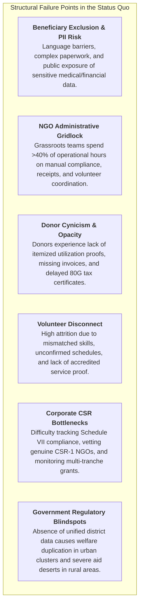
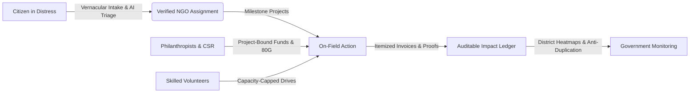

# Project Abstract: NGO Digital Connect
### *Connecting People. Empowering Communities. Creating Measurable Impact.*

---

## 1. Executive Abstract

**NGO Digital Connect** is a multi-stakeholder digital platform engineered to unify and formalize the fragmented social impact landscape in India. Grounded in a transparent operational lifecycle:

$$\textbf{NEED} \longrightarrow \textbf{ACTION} \longrightarrow \textbf{IMPACT}$$

The platform bridges the systemic divide between seven vital stakeholder groups:
1. **Citizens in Need (Beneficiaries)**
2. **Accredited Non-Governmental Organizations (NGOs)**
3. **Skilled Volunteers**
4. **Philanthropic Donors**
5. **Corporate Social Responsibility (CSR) Grantors**
6. **Government Social Welfare Regulators**
7. **Platform Oversight Administrators**

By replacing manual spreadsheets, unverified social media solicitations, and opaque donation pipelines with a verified, low-bandwidth, mobile-first web ecosystem, NGO Digital Connect delivers real-time distress triage, strict Personally Identifiable Information (PII) seclusion, milestone-anchored crowdfunding with invoice-level utilization ledgers, automated Section 80G tax receipting, and district-level welfare density mapping.

---

## 2. The Problem Statement

India's non-profit and social welfare sector faces critical structural bottlenecks that hinder timely relief, erode donor trust, and duplicate humanitarian resources:



### Specific Problem Dimensions

1. **Information Asymmetry & Compromised Dignity for Beneficiaries:**
   Citizens facing acute distress (medical emergencies, child educational dropouts, malnutrition, natural disasters) lack centralized mechanisms to find verified local non-profits. They often fall prey to predatory intermediaries, while having their private medical scans, addresses, and phone numbers exposed online without consent.

2. **Grassroots NGO Operational Overload:**
   Field organizations drown in disjointed communication tools (WhatsApp groups, spreadsheets, paper registers). They struggle to coordinate volunteer cohorts, account for micro-donations, and prepare statutory NITI Aayog NGO Darpan and corporate CSR dossiers.

3. **Absence of Verifiable Capital Utilization:**
   Individual donors and institutional CSR committees hesitate to release capital due to "slush fund" concerns, where contributions cannot be tracked down to specific field milestones, vendor expenditure receipts, or real-time beneficiary headcounts.

4. **Volunteer Disengagement and Uncredited Service:**
   Skilled individuals find it cumbersome to discover verified, schedule-aligned opportunities (e.g., weekend field drives or remote teaching), while lacking formal, auditable proof of volunteer service hours for academic or professional resumes.

5. **Welfare Duplication and Regional Aid Deserts:**
   Government welfare nodal officers lack macro-level visibility into private NGO activities within their jurisdictions, leading to repeated food/medical ration distributions in identical urban slum pockets while adjoining rural panchayats receive zero relief.

---

## 3. The Proposed Solution

NGO Digital Connect solves these challenges through an integrated, database-enforced, and modular platform:



### Core Solution Modules & Capabilities

1. **AI-Assisted Citizen Intake & Strict Privacy Safeguards (Rule 101):**
   - **Vernacular NLP Triage:** Citizens submit free-form voice/text requests in 6 regional languages ([English, Hindi, Bengali, Marathi, Tamil, Telugu](file:///e:/ngo-digi/NGO-Digital-Connect/src/i18n/LanguageContext.tsx)). The built-in heuristic classifier ([`AiService.classifyRequestDescription`](file:///e:/ngo-digi/NGO-Digital-Connect/src/services/aiService.ts#L16-L89)) infers category (`healthcare`, `education`, `disaster_relief`, etc.), urgency (`CRITICAL`, `HIGH`, `MEDIUM`, `LOW`), and required support type in under 5 milliseconds.
   - **Zero Public PII:** Strict database Row Level Security (RLS) ensures phone numbers, physical residential addresses, and medical reports are decrypted only by the assigned, verified caseworker ([`BeneficiaryPortal.tsx`](file:///e:/ngo-digi/NGO-Digital-Connect/src/pages/portals/BeneficiaryPortal.tsx)).
   - **Visual Status Tracker:** 11-stage transparent progress tracking from `SUBMITTED` $\rightarrow$ `UNDER_REVIEW` $\rightarrow$ `VERIFIED` $\rightarrow$ `MATCHED` $\rightarrow$ `IN_PROGRESS` $\rightarrow$ `RESOLVED`.

2. **NGO Operations Hub & Autonomous AI Copilot:**
   - **Intake Desk & Geolocation Triage:** Grassroots NGOs claim cases filtered by geographic proximity and focus area ([`NgoPortal.tsx`](file:///e:/ngo-digi/NGO-Digital-Connect/src/pages/portals/NgoPortal.tsx)).
   - **AI Operations Copilot:** Natural language assistant ([`NgoAssistantModal.tsx`](file:///e:/ngo-digi/NGO-Digital-Connect/src/components/ai/NgoAssistantModal.tsx)) answering operational queries (e.g., *"Which urgent medical cases remain unassigned?"*, *"Show projects nearing budget deficits"*).
   - **Statutory Dossier Generator:** 1-click printable executive impact reports formatted for CSR committees and government filings.

3. **Audited Crowdfunding & Instant Section 80G Receipts (Rules 103 & 104):**
   - **Zero Unanchored Slush Funds:** All contributions must bind directly to an active `ProjectID` with quantifiable milestones.
   - **Itemized Utilization Ledger:** NGOs can only mark funds as spent by attaching a vendor name, expenditure category, amount, and invoice URL ([`ProjectDetailPage.tsx`](file:///e:/ngo-digi/NGO-Digital-Connect/src/pages/public/ProjectDetailPage.tsx)).
   - **Instant Section 80G Tax Receipts:** System automatically generates and stamps formal, print-ready 80G certificates with NGO PAN and registration details upon contribution confirmation ([`DonorPortal.tsx`](file:///e:/ngo-digi/NGO-Digital-Connect/src/pages/portals/DonorPortal.tsx)).

4. **Volunteer Mobilization Engine with Deterministic Quotas (Rule 102):**
   - Dynamic capacity locking prevents over-allocation for field drives ([`OpportunitiesPage.tsx`](file:///e:/ngo-digi/NGO-Digital-Connect/src/pages/public/OpportunitiesPage.tsx)).
   - Profile-to-opportunity skill matching algorithm ([`AiService.matchOpportunitiesForVolunteer`](file:///e:/ngo-digi/NGO-Digital-Connect/src/services/aiService.ts#L125-L157)).
   - Accredited digital service hour logbook verified by host NGOs ([`VolunteerPortal.tsx`](file:///e:/ngo-digi/NGO-Digital-Connect/src/pages/portals/VolunteerPortal.tsx)).

5. **Institutional CSR Suite (MCA Section 135 & Schedule VII):**
   - Dedicated portal for corporate grant allocation against Schedule VII thematic codes ([`CsrPortal.tsx`](file:///e:/ngo-digi/NGO-Digital-Connect/src/pages/portals/CsrPortal.tsx)).
   - Multi-lakh grant tranche disbursement tied to verifiable field milestone completions.

6. **Government Social Welfare & Anti-Duplication Monitoring:**
   - Macro-level district social density heatmaps across major Indian states ([`GovernmentPortal.tsx`](file:///e:/ngo-digi/NGO-Digital-Connect/src/pages/portals/GovernmentPortal.tsx)).
   - Welfare cross-referencing to flag duplicate aid distribution across multiple concurrent agencies.

7. **Multi-Tier SaaS Monetization (Razorpay Subscriptions + Supabase BaaS):**
   - Authoritative subscription state machine ([`Free Starter`, `NGO Pro`, `NGO Enterprise`](file:///e:/ngo-digi/NGO-Digital-Connect/src/types/subscription.ts#L1-L38)) backed by Razorpay Autopay and HMAC SHA-256 webhook verification ([`server/src/index.ts`](file:///e:/ngo-digi/NGO-Digital-Connect/server/src/index.ts#L43-L50)).
   - Unlocks advanced enterprise features: AI Copilot, high-volume case intake, and Schedule VII CSR integration ([`PricingPage.tsx`](file:///e:/ngo-digi/NGO-Digital-Connect/src/pages/public/PricingPage.tsx)).

---

## 4. Repository & File Structure Map

```
NGO-Digital-Connect/
├── Documentation & Specifications
│   ├── README.md                      # Platform overview, persona switcher guide, and setup instructions
│   ├── PRD.md                         # Authoritative Product Requirements Document & User Stories
│   ├── SYSTEM_ARCHITECTURE.md         # System Architecture, Component Layers & Architecture Decision Records
│   ├── TRED.md                        # Technical Requirements Document & Entity-Relationship Specifications
│   ├── SECURITY.md                    # STRIDE Threat Model, OWASP Hardening & DPDP Act Compliance
│   └── abstract.md                    # Concise Academic & Architectural Project Abstract
│
├── Frontend Application (src/)
│   ├── types/
│   │   ├── models.ts                  # Core domain models (User, HelpRequest, Project, Donation, etc.)
│   │   └── subscription.ts            # Subscription plans, statuses, limits, and Razorpay interfaces
│   ├── store/
│   │   ├── AuthContext.tsx            # Session state, RBAC authorization, and 1-click persona switcher
│   │   ├── DataContext.tsx            # Global state manager, audit logs, and Supabase realtime channels
│   │   ├── SubscriptionContext.tsx    # Authoritative billing state, plan verification, and checkout triggers
│   │   └── ThemeContext.tsx           # Instant Light/Dark mode state management via CSS custom properties
│   ├── services/
│   │   ├── aiService.ts               # In-browser NLP triage classifier, matchers, and NGO Copilot
│   │   ├── storageService.ts          # LocalStorage fallback persistence for offline/low-bandwidth resilience
│   │   ├── subscriptionApi.ts         # REST client communicating with Node.js subscription server
│   │   └── supabaseService.ts         # PostgREST data access layer supporting 21 relational tables
│   ├── i18n/
│   │   ├── LanguageContext.tsx        # Multi-language state with fallback to English
│   │   ├── types.ts                   # Deeply typed translation key schemas
│   │   └── translations/              # Dictionaries: en, hi, bn, mr, ta, te
│   ├── components/
│   │   ├── ai/
│   │   │   └── NgoAssistantModal.tsx  # Floating interactive AI assistant modal for NGO directors
│   │   └── common/
│   │       ├── Header.tsx             # Universal navigation, quick persona switcher, and notification drawer
│   │       ├── Footer.tsx             # Statutory credentials, transparency metrics, and seed reset
│   │       ├── Icons.tsx              # Zero-dependency Lucide-style SVG icon system
│   │       ├── Badge.tsx              # Urgency, status, and cause pill tags
│   │       ├── ProgressBar.tsx        # Crowdfunding and volunteer capacity meter
│   │       ├── LanguageSwitcher.tsx   # Regional language selector dropdown
│   │       └── ThemeToggle.tsx        # Light/Dark mode toggle button
│   ├── pages/
│   │   ├── public/
│   │   │   ├── HomePage.tsx           # Public landing page with live calculated impact counters
│   │   │   ├── NgoDirectoryPage.tsx   # Searchable directory with 12A/80G/CSR-1 accreditation badges
│   │   │   ├── NgoDetailPage.tsx      # Comprehensive NGO profile with active causes and verified projects
│   │   │   ├── ProjectDirectoryPage.ts# Public initiative catalog with funding and volunteer progress
│   │   │   ├── ProjectDetailPage.tsx  # Crowdfunding page with itemized expense ledger and 80G checkout
│   │   │   ├── OpportunitiesPage.tsx  # Volunteer drive catalog with capacity indicators
│   │   │   ├── ImpactPage.tsx         # Calculated platform ledger and real-time public audit log
│   │   │   ├── PricingPage.tsx        # Subscription pricing matrix with Razorpay Checkout modal
│   │   │   ├── LoginPage.tsx          # Dual-mode authentication (Supabase Auth & 1-click persona demo)
│   │   │   └── RegisterPage.tsx       # 7-role onboarding questionnaire with role-specific credential intake
│   │   └── portals/
│   │       ├── BeneficiaryPortal.tsx  # Citizen intake wizard, real-time case timeline, and caseworker chat
│   │       ├── NgoPortal.tsx          # Inbound case triage desk, project builder, expense logger, and volunteer desk
│   │       ├── VolunteerPortal.tsx    # Volunteer profile, smart AI match feed, and verified hours logbook
│   │       ├── DonorPortal.tsx        # Contribution portfolio, audited expenditure breakdowns, and 80G vault
│   │       ├── CsrPortal.tsx          # Schedule VII grant management, budget tracking, and corporate audits
│   │       ├── GovernmentPortal.tsx   # District social density heatmaps and welfare duplication checks
│   │       └── AdminPortal.tsx        # NGO KYC accreditation desk, moderation, and immutable audit explorer
│   ├── App.tsx                        # Master router binding public views and role-restricted portals
│   └── index.css                      # Vanilla CSS design system with curated HSL color tokens
│
├── Backend Subscription Server (server/)
│   ├── src/
│   │   ├── index.ts                   # Express application entrypoint with raw body webhook mounting
│   │   ├── config/
│   │   │   ├── env.ts                 # Environment variable validation (Razorpay & Supabase credentials)
│   │   │   └── plans.ts               # Authoritative definitions for Free, Pro, and Enterprise tiers
│   │   ├── controllers/
│   │   │   └── subscriptionController.ts # Subscription checkout, cancel, status, and webhook handling
│   │   ├── middleware/
│   │   │   ├── auth.ts                # Supabase JWT token verification
│   │   │   └── rateLimit.ts           # Protection against brute-force and webhook replay attacks
│   │   ├── routes/
│   │   │   └── subscriptionRoutes.ts  # Express route definitions for `/api/subscriptions/*`
│   │   └── services/
│   │       ├── razorpayService.ts     # Razorpay API client (subscription creation and status sync)
│   │       └── supabaseAdmin.ts       # Supabase service role client updating the database
│   └── package.json                   # Server dependencies (Express, Razorpay SDK, Supabase JS)
│
└── Database & Migrations (supabase/)
    ├── schema.sql                     # Full schema: 21 relational tables, foreign keys, triggers, and indexes
    ├── seed.sql                       # Complete realistic multi-tenant seed data across all 7 user roles
    └── migrations/
        ├── 20261001_realtime_auth_rls.sql      # Database triggers (`handle_new_user`) & strict RLS policies
        └── 20261003_subscriptions_razorpay.sql # Subscriptions, payment_events table, and auto-provision trigger
```

---

## 5. Technical Highlights & Engineering Decisions

| Architectural Vector | Strategy & Implementation | Rationale |
|---|---|---|
| **Frontend Execution** | React 19 + TypeScript + Vite | Ultra-fast client-side execution producing a gzipped bundle under **180 KB**, ideal for 2G/3G mobile networks. |
| **Styling & Theming** | Pure Vanilla CSS Tokens ([`index.css`](file:///e:/ngo-digi/NGO-Digital-Connect/src/index.css)) | Zero runtime CSS-in-JS overhead; instant dark/light mode switching; no bulky third-party UI framework bloat. |
| **Resilience & Storage** | Dual-Engine Persistence | Primary persistence via Supabase PostgreSQL; seamless fallback to browser `localStorage` ([`storageService.ts`](file:///e:/ngo-digi/NGO-Digital-Connect/src/services/storageService.ts)) for offline field demonstrations. |
| **Data Isolation & Security**| PostgreSQL Row Level Security (RLS) | Security boundary enforced at the database tier ([`20261001_realtime_auth_rls.sql`](file:///e:/ngo-digi/NGO-Digital-Connect/supabase/migrations/20261001_realtime_auth_rls.sql)), making client-side bypasses impossible. |
| **Payment Integrity** | Razorpay Autopay + Raw Webhooks | Cryptographic HMAC SHA-256 signature verification over raw byte streams ([`index.ts`](file:///e:/ngo-digi/NGO-Digital-Connect/server/src/index.ts#L43-L50)) and idempotency recording in `payment_events`. |
| **Client AI Execution** | In-Browser NLP Heuristics ([`aiService.ts`](file:///e:/ngo-digi/NGO-Digital-Connect/src/services/aiService.ts)) | Zero API latency (< 5ms), zero cloud cost per ticket, works offline, and guarantees citizen data privacy. |

---

## 6. Measurable Impact Targets (KPIs)

| Metric | Traditional Baseline | NGO Digital Connect Target | Mechanism |
|---|---|---|---|
| **Mean Time to Case Review (MTCR)** | > 72 hours (manual paperwork) | **< 6 hours** | Real-time intake notification and AI categorization. |
| **Fund Traceability & Utilization** | ~0% itemized proof | **100% on active projects** | Compulsory invoice, vendor, and category logging. |
| **Accreditation Rigor** | Unregulated / self-declared | **100% verified KYC** | Admin review of 12A/80G, PAN, and CSR-1 numbers. |
| **Tax Exemption Issuance** | Weeks to months | **Instant (< 5 seconds)** | Automated Section 80G certificate PDF generator. |
| **Volunteer Drive Fill Rate** | ~30% | **> 75% within 7 days** | Smart skill matching and capacity-enforced caps. |
| **Linguistic Accessibility** | English-only (0% regional) | **> 45% non-English adoption** | Native support for Hindi, Bengali, Marathi, Tamil, Telugu. |
